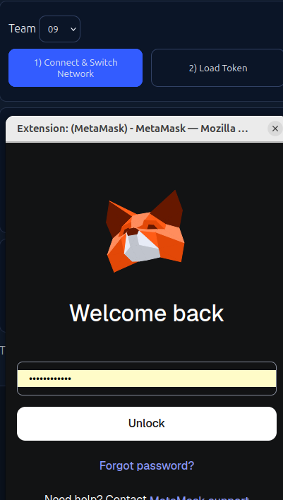
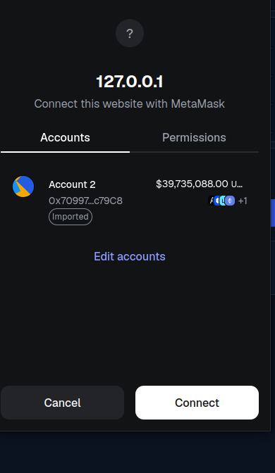
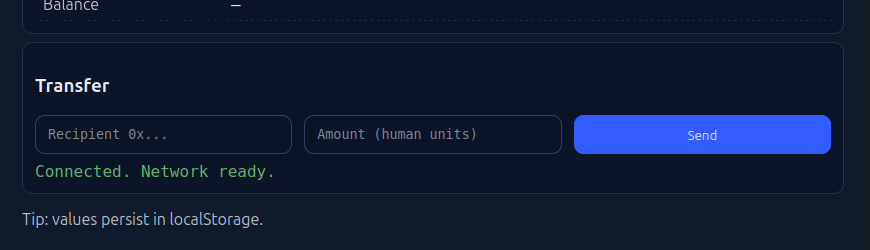
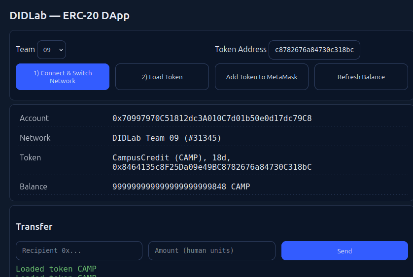
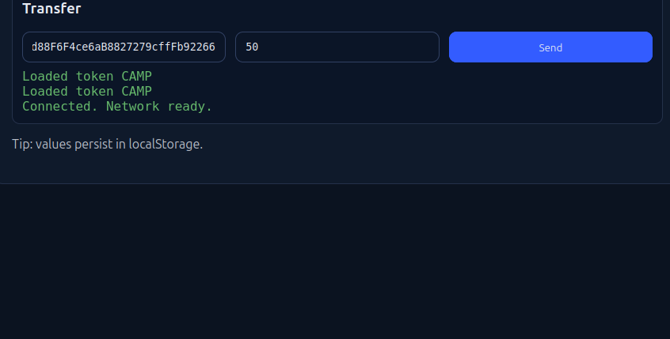
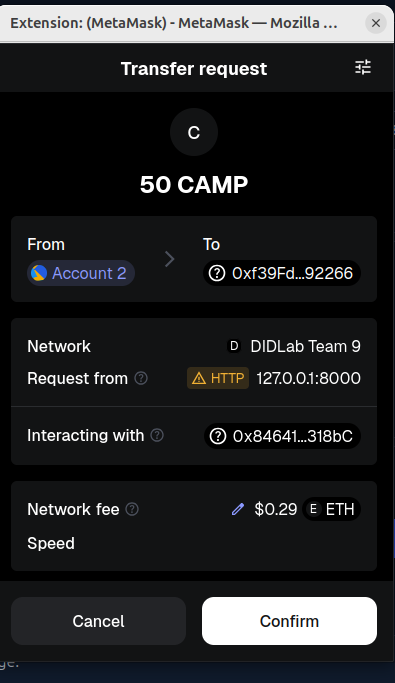
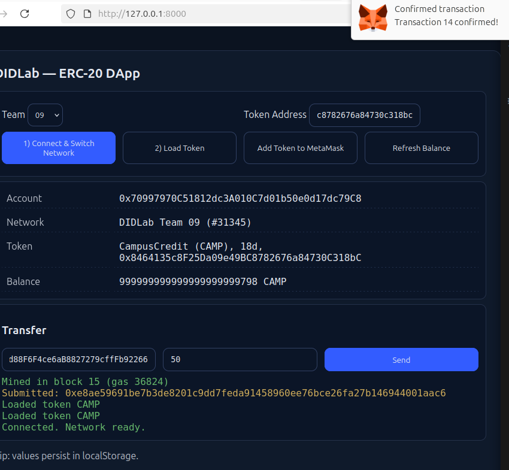
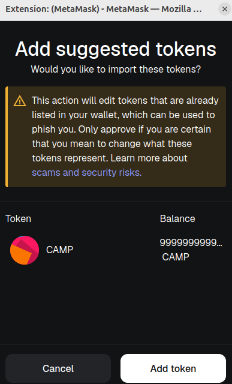
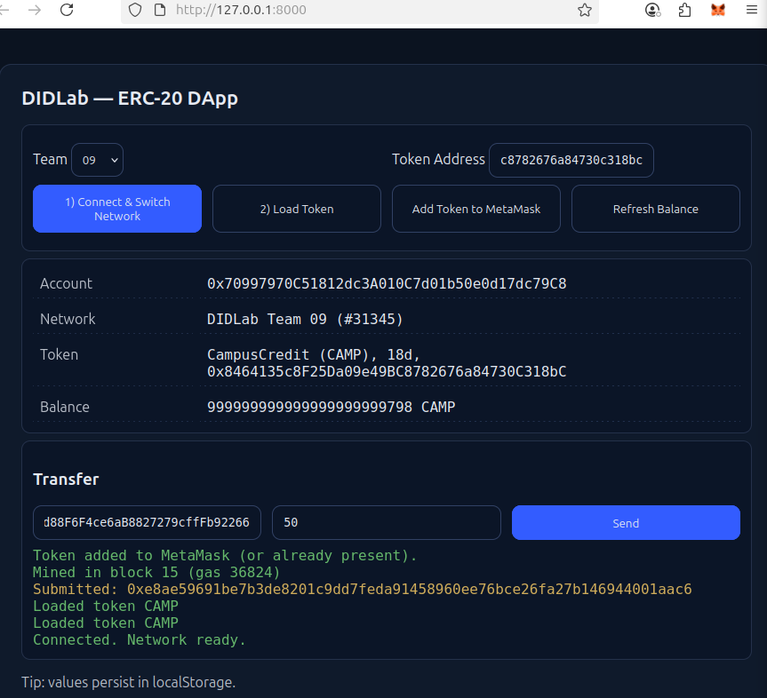

# DIDLab ERC-20 DApp

A minimal web-based DApp to interact with your team’s ERC-20 token on the DIDLab test networks.

---

## **Project Overview**

This single-file web app allows you to:

- Connect MetaMask and switch/add your team’s DIDLab network.
- Load your ERC-20 token (name, symbol, decimals).
- View your token balance.
- Transfer tokens between accounts.
- Add the token to MetaMask for easy tracking.
- Automatically refresh balances on transfers.

---

## **Prerequisites**

- Node.js v22.x installed.
- MetaMask installed in your browser.
- Your **team’s DIDLab RPC** and **Chain ID**.
- Your **ERC-20 token address** deployed on your team network.
- Faucet/private key imported into MetaMask so your account has ETH and tokens.

---

## **Setup**

1. Create project folder:

```bash
mkdir didlab-dapp
cd didlab-dapp
```

2. Create `index.html` and paste the DApp code.
3. Edit the **CONFIG** block at the top with your team number and token address.
4. Serve locally if your browser blocks `file://` module imports:

```bash
python3 -m http.server 8000
# or
npx http-server -p 8000
```

5. Open your browser to: `http://localhost:8000`

---

## **Usage Steps**

### **1. Connect & Switch Network**

- Select your team from the dropdown (e.g., Team 09).
- Click **Connect & Switch Network**.
- Approve the network in MetaMask.
  

---

### **2. Load Token**

- Enter your **ERC-20 token address**.
- Click **Load Token**.
- The token name, symbol, decimals, and your balance will appear.
  

---

### **3. Transfer Tokens**

- Enter a **recipient address** and **amount** (human units).
- Click **Send**.
- Your transaction hash and confirmation will appear in the log.
- Balance updates automatically.
  

---

### **4. Add Token to MetaMask**

- Click **Add Token to MetaMask** to see your token in your wallet.
  

---

### **5. Refresh Balance (Optional)**

- Click **Refresh Balance** to manually update if needed.

---

## **Tips / Troubleshooting**

- **Nothing happens on Connect** → Ensure MetaMask is installed and enabled.
- **Wrong network** → Approve network switch/add prompt in MetaMask.
- **No data returned (0x)** → The token address might be wrong or not deployed on your network.
- **Insufficient funds** → Make sure your account has ETH for gas and token balance to send.

## **Screenshots**


















